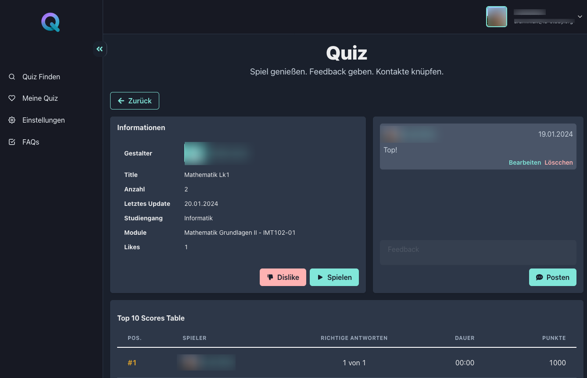

<div align="center">  
<h1>IU QUIZ WEB APP</h1>
<h2>Software Engineering Projekt der <a href="https://www.iu.de/?utm_source=google&utm_medium=cpc&utm_campaign=10501369421&utm_term=iu&utm_content=125084765412&device=c&gad_source=1&gclid=Cj0KCQiApOyqBhDlARIsAGfnyMp_kJrZfZCK37ERJ9tscoOUdT768dxy_APpFlWmbn-L8jNAwwR1k9kaAnQDEALw_wcB">IU Hochschule<a/> - ISEF01
</h2>

  

</div>

Das Projekt hat das Thema "Konzeption und prototypische Umsetzung eines kooperativen und kollaborativen Online-Quizsystems". Das Ziel der Fallstudie ist es, ein Online-Quizsystem zu entwickeln, das den Studierenden des Fernstudiums der IU dabei hilft, ihre Lerninhalte für die Klausurvorbereitung zu festigen.

Das System ermöglicht den Studierenden, kooperativ und kollaborativ Antworten auf fachliche Fragen zu finden. Dabei liegt der Fokus auf dem gemeinsamen Spielen und Erarbeiten.



#### Built With


#### install project dependencies

```sh
npm run install-dep
```

#### run project locally

```sh
npm run dev
```

#### run tests

```sh
 npm test
```

#### requirements

- Node.js version 20 or higher.
